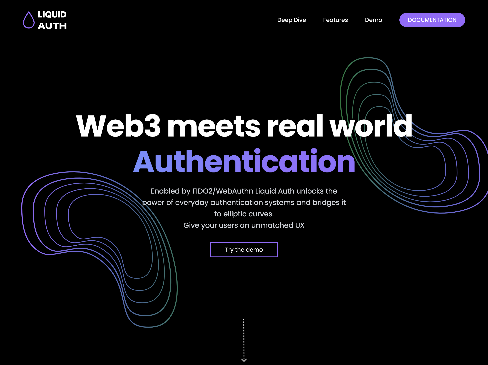

# ☑️ Supported Wallets

## Defly

Defly Wallet is a mobile-first Algorand wallet with advanced features for DeFi enthusiasts. It offers a user-friendly interface, portfolio tracking, and built-in swap functionality. Defly currently supports mobile connections via their iOS/Android apps, and will soon offer a browser extension wallet (currently in development), making it versatile for various dApp interactions.

<figure><figcaption></figcaption></figure>




Defly Connect


## Pera

Pera Wallet, formerly known as Algorand Wallet, provides a secure and easy-to-use mobile interface for managing Algorand assets. Pera Explorer is a companion web-based block explorer for convenient transaction and account monitoring. The upcoming Pera Connect v2 library (currently in beta) will support WalletConnect v2, enhancing its integration capabilities with Algorand dApps across various platforms.

<figure><figcaption></figcaption></figure>




Pera Connect


## Exodus

Exodus is a multi-cryptocurrency wallet that supports Algorand along with many other blockchain assets. Known for its sleek design and user-friendly interface, Exodus offers desktop, mobile, and browser extension options, providing flexibility for users across different platforms.

<figure><figcaption></figcaption></figure>




Exodus Algorand Provider API


## WalletConnect

WalletConnect is not a wallet itself, but a protocol that enables secure connections between mobile wallets and desktop dApps. It allows users to interact with Algorand dApps using their preferred mobile wallet, bridging the gap between mobile and desktop experiences. The WalletConnect provider can be used to connect with any WalletConnect v2 supporting wallet, including Defly, Pera, Fireblocks and more.&#x20;

<figure><figcaption></figcaption></figure>




WalletConnect Sign Client API (Dapp Usage)


## Lute

Lute Wallet is an Algorand wallet available as both a web wallet and a Chrome browser extension. Primarily designed for Ledger hardware wallet users, it offers secure interaction with Algorand dApps and asset management. Lute also serves as an excellent wallet for local development and testing. Its versatility makes it ideal for security-conscious users, developers, and desktop users seeking a convenient browser-based Algorand wallet.




Lute Connect


## Kibisis

Kibisis is a browser extension wallet designed for the Algorand Virtual Machine (AVM) ecosystem. Uniquely, it supports both Algorand and Voi, making it versatile across all AVM-compatible chains. Kibisis distinguishes itself by focusing on assets as utility beyond just DeFi applications. Available for Chrome, Edge, and Brave browsers.

<figure><figcaption></figcaption></figure>




AVM Web Provider


## Magic

Magic Auth provides passwordless authentication for dApps, allowing users to log in using their email, phone, or social media accounts. While not a traditional cryptocurrency wallet, it offers a way for users to interact with Algorand dApps without needing to manage seed phrases or private keys directly.

<figure><figcaption></figcaption></figure>




Magic Algorand Extension


## Liquid Auth (experimental)

Liquid Auth is a self-hosted authentication service that provides a simple way to associate Passkeys to KeyPair(s) commonly found in cryptocurrencies. In addition to authentication, Liquid Auth provides a Peer to Peer signaling service. Not only can you authenticate users, but you can also establish secure connections between them.


The Liquid Auth provider is currently experimental and subject to change in future releases. It requires users to have an Android device and developers to set up a [specific backend](https://github.com/TxnLab/use-wallet/blob/main/examples/liquid-auth-backend/README.md). For more info, please refer to the [documentation](https://liquidauth.com/guides/getting-started/).


<figure><figcaption></figcaption></figure>


Liquid Auth documentation



Liquid Auth backend README


## Biatec

Biatec Wallet (formerly AWallet) is the first fully open-source wallet in the Algorand ecosystem, built by and for the community. It offers comprehensive account management, including support for standard and multisig accounts, along with advanced features like account rekeying and dApp integration via WalletConnect. Biatec also provides multilanguage support, making it accessible to a diverse user base across the Algorand ecosystem.

<figure><figcaption></figcaption></figure>




AWallet source code


## KMD

The KMD (Key Management Daemon) wallet provider is a development-focused solution that integrates with Algorand's `goal` CLI tool. It's primarily used for testing and local development environments, allowing developers to easily manage and use accounts created with the Algorand node software. KMD provides a convenient way to interact with local Algorand networks and sign transactions in development scenarios, making it an essential tool for Algorand developers working on dApps or smart contracts.&#x20;


**Important:** KMD is not intended for production use or for managing real assets on MainNet.



KMD Documentation


## Mnemonic

The Mnemonic wallet provider is a specialized tool designed for testing purposes, particularly for integration tests. It should only be used in a test environment for running automated tests that require wallet interactions. (Documentation coming soon)


**Warning:** The Mnemonic wallet provider is strictly for testing and development purposes. It will not function if the active network is set to MainNet. Any accounts used with the Mnemonic wallet should be considered insecure and should never hold MainNet ALGO or ASAs with any real value.


## Custom Provider

The Custom wallet provider allows developers to integrate wallets that are not natively supported by the library or implement specialized wallet interactions tailored to their application's needs. This flexibility ensures that the library can adapt to new or unique wallet solutions in the Algorand ecosystem. For detailed information on how to implement a custom wallet provider, please see the Custom Provider Guide:


[custom-provider.md](custom-provider.md)

